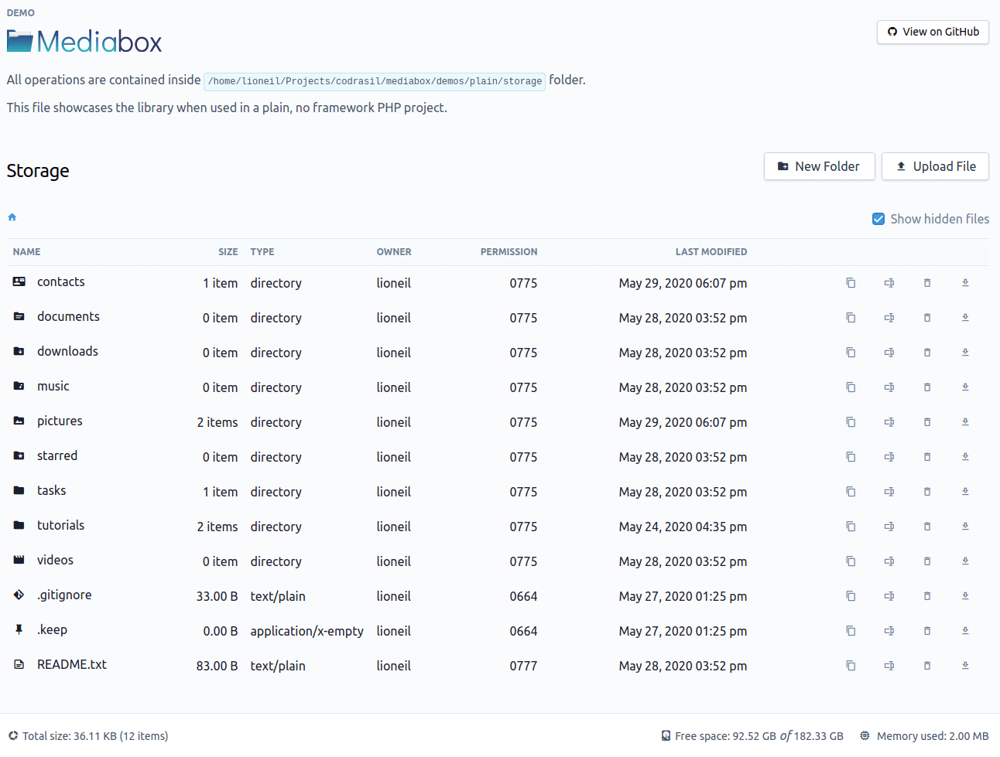

<p align="center"></p>

<br>

## About Mediabox

Mediabox is a PHP implementation of a __web-based file management system__. The library makes it easy to interact with the local disk storage's files and folders.

Features include:

* Adding of files and folders
* Copying
* Deleting files from disk
* Displaying and downloading files from browser
* Renaming and Moving files and folders.
* Toggling of hidden files
* Easy syntax to retrieve file meta info like size, permission, last modified date, owner, etc.

Mediabox is also a [Laravel](https://github.com/laravel/laravel) package out-of-the-box with minimal setup.

<br>

### Demonstration
Clone or download this repository then run the `demo:plain` composer script:
```bash
git clone https://github.com/codrasil/mediabox
cd mediabox/ && composer install
composer demo:plain
```
The above command will run a built-in PHP server at localhost:8080.



You may also run `composer demo:prep` to generate dummy files and folders for the demo.

<br>
---
<br>

### Requirements

* `PHP`: `7+`
* `illuminate/filesystem`: `^7.11`
* `symfony/http-foundation`: `^5.0`

<br>
---
<br>

### Installation

The library can be installed via composer:
```bash
composer require codrasil/mediabox
```

<br>

##### Publishing Configuration
If used in a Laravel project, the configuration file can be published via `artisan` command:

```bash
php artisan vendor:publish --tag mediabox
```

See <a href="./docs/Laravel.md">docs/Laravel.md</a> for instructions on how to setup in a Laravel project.

<br>

### Usage

##### Plain PHP

```php
use Codrasil\Mediabox\Mediabox;

...

$rootStoragePath = '/path/to/a/storage/folder';
$baseStoragePath = $_GET['p'] ?: $rootStoragePath;

$mediabox = new Mediabox($baseStoragePath, $rootStoragePath);

$mediabox->showHiddenFiles($yes = true);

foreach ($mediabox->all() as $file) {
    if ($file->isDir()) {
        echo $file->name().'/'.PHP_EOL;
    } else {
        echo $file->name().PHP_EOL;
    }
}
```

##### Laravel

If using within a Laravel project, just inject the `Codrasil\Mediabox\Mediabox` class to a controller or another class.

```php
// routes/web.php

use Codrasil\Mediabox\Mediabox;
use Illuminate\Http\Request;

Route::get('media', function (Request $request, Mediabox $mediabox) {
    return view('path.to.a.view')->withMediabox($mediabox);
});
```

```blade
{{-- resources/views/path/to/a/view.blade.php --}}

@foreach ($mediabox->all() as $file)
  @if ($file->isDir())
    <p><i class="{{ $file->icon() }}">&nbsp;</i>{{ $file->name() }}/</p>
  @else
    <p><i class="{{ $file->icon() }}">&nbsp;</i>{{ $file->name() }}</p>
  @endif
@endforeach
```

Note by default, the library will list the files and folders listed in `storage/app/public`.
To change the path, update the `root_path` value in `config/mediabox.php` file.

All the necessary setup is taken cared of by the `Codrasil\Mediabox\MediaboxServiceProvider` class.

See `config/mediabox.php` to view all available customization options.

See also <a href="./docs/Laravel.md">docs/Laravel.md</a> for more information on how to use the library on a Laravel project.

<br>

#### Adding
```php
$mediabox->addFolder('Reminders');
$mediabox->addFile('Reminders/groceries.todo', 'Milk');
```
Adding folders is recursive by default.

<br>

#### Copying
The `copy` method accepts the relative path of the file to be copied as first argument.
The second argument is the new file name.

```php
$mediabox->copy('Reminders/groceries.todo', 'Copy of groceries.todo');

$mediabox->copy('Reminders', 'Copy of Reminders');
// or
$mediabox->copyDirectory('Reminders', 'Copy of Reminders');

```

<br>

#### Moving or renaming
The `rename` and `move` methods accept a `$path` and `$target` destination.
```php
$mediabox->rename('Reminders/groceries.todo', 'Reminders/My Grocery List.todo');
// or
$mediabox->move('Reminders/groceries.todo', 'Reminders/My Grocery List.todo');
```

<br>

#### Deleting
The `delete` method can accept a path or array of paths.
```php
$mediabox->delete('Copy of Reminders');
$mediabox->delete('Copy of groceries.todo');
// or
$mediabox->delete(['Copy of Reminders', 'Copy of groceries.todo']);
```

<br>

#### Displaying & Downloading
To display a file on a browser, use the `fetch` method.
```php
$mediabox->fetch('/path/to/a/file.txt');
```

To force browser to download the file, use the `download` method.
```php
$mediabox->download('/path/to/a/file.txt');
```

Both methods will return an instance of `Symfony\Component\HttpFoundation\BinaryFileResponse`.

<br>
---
<br>

### Documentation & Examples

To learn more about the API, see the [docs](./docs) folder.

For more example implementation, checkout [docs/examples](./docs/examples) folder.

<br>

### License
The library is open-source software licensed under the [MIT license](./LICENSE).
