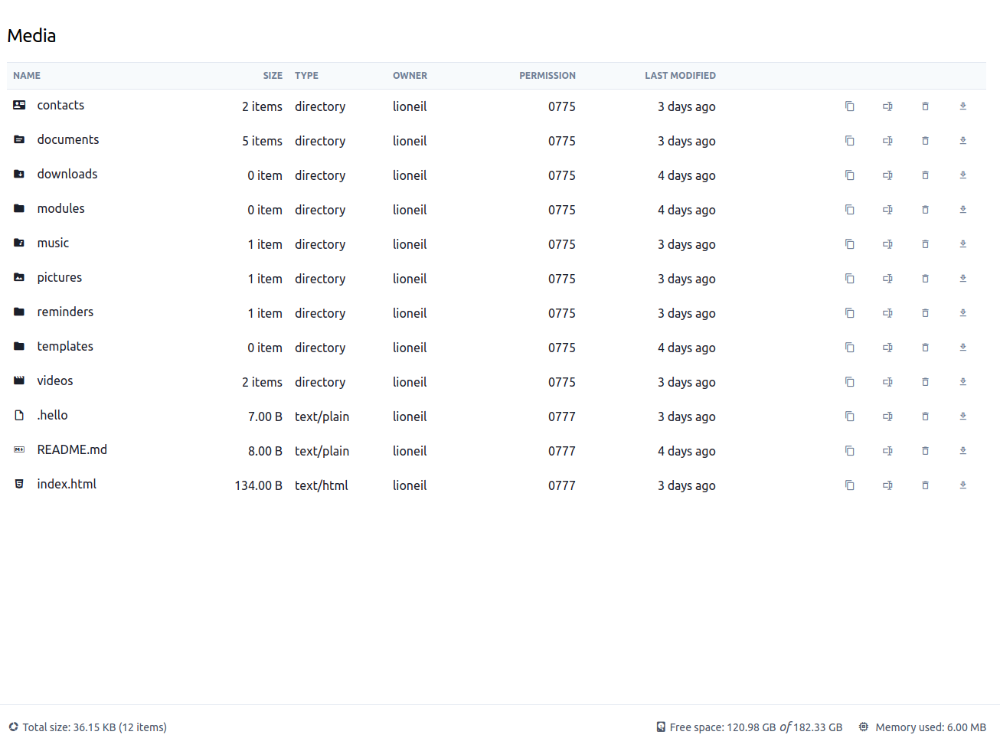

**How to Setup Mediabox in a Laravel Project**

<br>

#### Getting Started

Mediabox is a Laravel package out-of-the-box. With minimal setup, the library can be used as a web-based file manager or as an API to interact with the local disk.

This package only handles the backend side. The frontend UI is intentionally left bare bones in order for developers to have complete control on how to design and integrate it to their own existing projects. It is ideal to publish the view files then customize it from there.
See the [Views](#views) section to learn more.

<br>

#### Installation

The library can be installed via composer:
```bash
composer require codrasil/mediabox
```

Laravel should auto-discover the package once installation was successful.

<br>

#### Setup

The first step is to prepare the Laravel project's storage path. By default, the storage path is set to point to `storage/app/public/media`.

```bash
mkdir -p storage/app/public/media
```

This can easily be changed in the package's configuration file.
To change the storage path, publish the configuration file via artisan:

```bash
php artisan vendor:publish --tag mediabox
```

A file `mediabox.php` will be generated inside the `config/` folder.
Update the values of `root_path` and `base_path` if desired. Note that these values should match.

```php
// config/mediabox.php

return [
    ...
    'root_path' => '/new/folder/somewhere/safe/we/hope',
    'base_path' => '/new/folder/somewhere/safe/we/hope',
    ...
];
```

A console command is also provided to populate the storage path with empty folders:

```bash
php artisan mediabox:scaffold
```

<br>

#### Routes

The `MediaboxServiceProvider` will register 3 groups of routes - api, storage, and web routes.

Operations like adding, copying, and deleting of files are registered as both `api` and `web` routes.
Displaying and downloading of files is registered as the `storage` route. By default only the `api` and `storage` routes are enabled.

**Api Route**

The route group handles the operations and returns a JSON response.

```bash
> php artisan route:list --name media
+----------+-----------------------------+------------------+--------------------------------------------------------------+--------------+
| Method   | URI                         | Name             | Action                                                       | Middleware   |
+----------+-----------------------------+------------------+--------------------------------------------------------------+--------------+
| GET|HEAD | api/v1/media                | api.media.index  | Codrasil\Mediabox\Http\Controllers\MediaboxController@index  | api,bindings |
| POST     | api/v1/media/add            | api.media.add    | Codrasil\Mediabox\Http\Controllers\MediaboxController@add    | api,bindings |
| DELETE   | api/v1/media/delete         | api.media.delete | Codrasil\Mediabox\Http\Controllers\MediaboxController@delete | api,bindings |
| PATCH    | api/v1/media/move           | api.media.move   | Codrasil\Mediabox\Http\Controllers\MediaboxController@move   | api,bindings |
| GET|HEAD | api/v1/media/{media}        | api.media.show   | Codrasil\Mediabox\Http\Controllers\MediaboxController@show   | api,bindings |
| POST     | api/v1/media/{media}/copy   | api.media.copy   | Codrasil\Mediabox\Http\Controllers\MediaboxController@copy   | api,bindings |
| PATCH    | api/v1/media/{media}/rename | api.media.rename | Codrasil\Mediabox\Http\Controllers\MediaboxController@rename | api,bindings |
+----------+-----------------------------+------------------+--------------------------------------------------------------+--------------+
```

**Web Route Alternative**

This route group will return either an HTTP response or a View instance depending on the HTTP method.

```bash
> php artisan route:list --name media
+----------+----------------------+--------------+--------------------------------------------------------------+--------------+
| Method   | URI                  | Name         | Action                                                       | Middleware   |
+----------+----------------------+--------------+--------------------------------------------------------------+--------------+
| GET|HEAD | media                | media.index  | Codrasil\Mediabox\Http\Controllers\MediaboxController@index  | web          |
| POST     | media/add            | media.add    | Codrasil\Mediabox\Http\Controllers\MediaboxController@add    | web          |
| DELETE   | media/delete         | media.delete | Codrasil\Mediabox\Http\Controllers\MediaboxController@delete | web          |
| PATCH    | media/move           | media.move   | Codrasil\Mediabox\Http\Controllers\MediaboxController@move   | web          |
| GET|HEAD | media/{media}        | media.show   | Codrasil\Mediabox\Http\Controllers\MediaboxController@show   | web          |
| POST     | media/{media}/copy   | media.copy   | Codrasil\Mediabox\Http\Controllers\MediaboxController@copy   | web          |
| PATCH    | media/{media}/rename | media.rename | Codrasil\Mediabox\Http\Controllers\MediaboxController@rename | web          |
+----------+----------------------+--------------+--------------------------------------------------------------+--------------+
```

**Storage Route**

This route group handles the browser displaying and downloading of a file.

```bash
> php artisan route:list --name storage
+----------+-----------------------------+------------------+--------------------------------------------------------------+--------------+
| Method   | URI                         | Name             | Action                                                       | Middleware   |
+----------+-----------------------------+------------------+--------------------------------------------------------------+--------------+
| GET|HEAD | storage/{file}              | storage.show     | Codrasil\Mediabox\Http\Controllers\ShowStorageFile           | web          |
| GET|HEAD | storage/{file}/download     | storage.download | Codrasil\Mediabox\Http\Controllers\DownloadStorageFile       | web          |
+----------+-----------------------------+------------------+--------------------------------------------------------------+--------------+
```

They can be individually configured in the `config/mediabox.php` file under the `Routes & Storage Resource` section.

<br>

##### Manual Route Registration

It is possible to completely disable all routes by setting the `config('mediabox.routes.web.register')` value to `false`. Same with _api_ and _storage_ keys.

```php
// config/mediabox.php

return [
    ...
    'routes' => [
        'web' => [
            ...
            'register' => false,
        ],
        'api' => [
            ...
            'register' => false,
        ],
        'storage' => [
            ...
            'register' => false,
        ],
    ...
];
```

Then manually write custom routes or reuse the provided route macros - `apiMediaResource`, `mediaResource`, and `storageResource`:

* **via `apiMediaResource` route macro:**
```php
// routes/api.php

use Codrasil\Mediabox\Http\Controllers\MediaApiController;

Route::middleware('auth:api')->group(function () {
    Route::apiMediaResource('media', MediaApiController::class);
});
```

* **via `mediaResource` route macro:**
```php
// routes/web.php

use Codrasil\Mediabox\Http\Controllers\MediaController;

Route::prefix('admin')->group(function () {
    Route::mediaResource('media', MediaController::class); // or your own controller with your own view files.
});
```

* **via `storageResource` route macro:**
```php
// routes/web.php

use Codrasil\Mediabox\Http\Controllers\ShowStorageFile;

Route::group(function () {
    Route::storageResource('storage', ShowStorageFile::class);
});
```

<br>

##### When to Use Which Route

This will depend on the requirement of the project.

If working on a Laravel project that only functions as an API provider to a separate SPA application, it is ideal to only enable `api` route.
If working on a traditional PHP application, it is ideal to enable the `web` and `storage` routes.
Finally, if working on a Laravel+VueJS application (not quite SPA; still uses blade file on some pages), it is ideal to enable `api` and `storage` routes.


<br>

#### Views

The package comes with its own minimal blade views and components to display the media files list, and to also preview individual files.

Of course, when working with blade views and components, the route `web` should be enabled. The `storage` route is also recommended to display and download files.

```php
// config/mediabox.php

return [
    ...
    'routes' => [
        'web' => [
            ...
            'register' => true,
        ],
        'storage' => [
            ...
            'register' => true,
        ],
    ],
];
```

Visiting `localhost:8000/media` will render the default page of the list of files and folders:

**Screenshot**


---

**View Components**

The package also comes preloaded with its own custom Blade Components:

* Breadcrumbs
  ```blade
  <x-mediabox-breadcrumbs :home="true|false"/>
  ```
* File Link
  ```blade
  <x-mediabox-file-link :file="$file"/>
  ```
* Operation Buttons
  ```blade
  <x-mediabox-copy-link     :file="$file" text="..." icon="..."/>
  <x-mediabox-rename-link   :file="$file" text="..." icon="..."/>
  <x-mediabox-delete-link   :file="$file" text="..." icon="..."/>
  <x-mediabox-download-link :file="$file" text="..." icon="..."/>
  <!-- Only works with type files (not dir) -->
  <x-mediabox-preview-link   :file="$file" text="..." icon="..."/>
  ```
* Sort Link
  ```blade
  <x-mediabox-sort-link ascending-icon="..." descending-icon="..." label="File Name" key="name"/>
  ```

The components are styled using:

* [TailwindCSS](https://tailwindcss.com/); and
* [Material Design Icons](https://materialdesignicons.com/) for the iconfonts.

An aliased Blade include file is added to the head tag to style the modals used in the pages.

```blade
<head>
  ...
  @mediaboxModalStyles
</head>
```

Make sure to include these dependencies in order for the components to display correctly.

<br>

**Publishing View Files**

It is possible to completely customize the blade components and forego using the above mentioned frontend dependencies. To do so, just publish the files via `artisan` command using the tag _`mediabox:views`_:

```bash
php artisan vendor:publish --tag mediabox:views
```

Then simply customize the copied files located at `/resources/views/vendor/mediabox`.

<br>

---

#### Further Reading

Mediabox as a Laravel package offering developers a feature rich, easy-to-customize web-based file management, ready to integrate into their existing projects. The frontend is designed to be minimal and \(ideally\) should be customized to fit the aesthetic of the project it is being integrated to.

Learn more about Laravel usage in [docs](./) folder.

* [How to Use Mediabox in a Laravel API backend](./Laravel/API.md)
* [How to Use the javascript libary @mediabox/ui in a VueJS project](./VueJS/UI.md)
